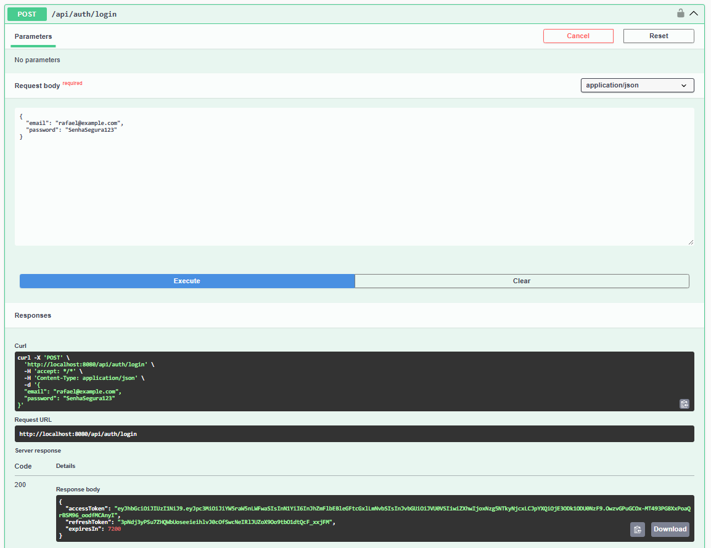
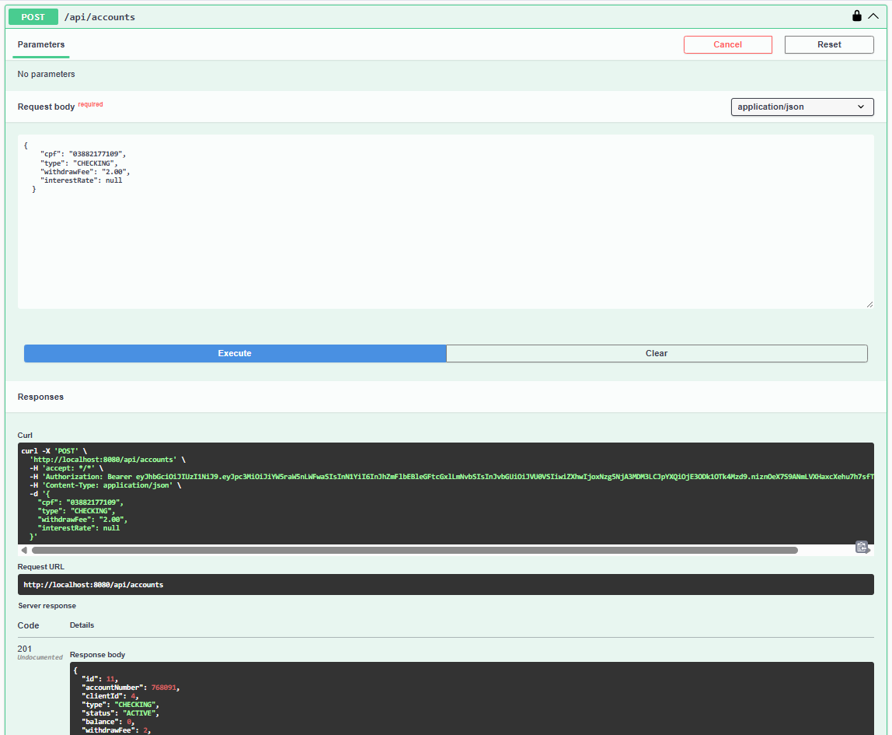
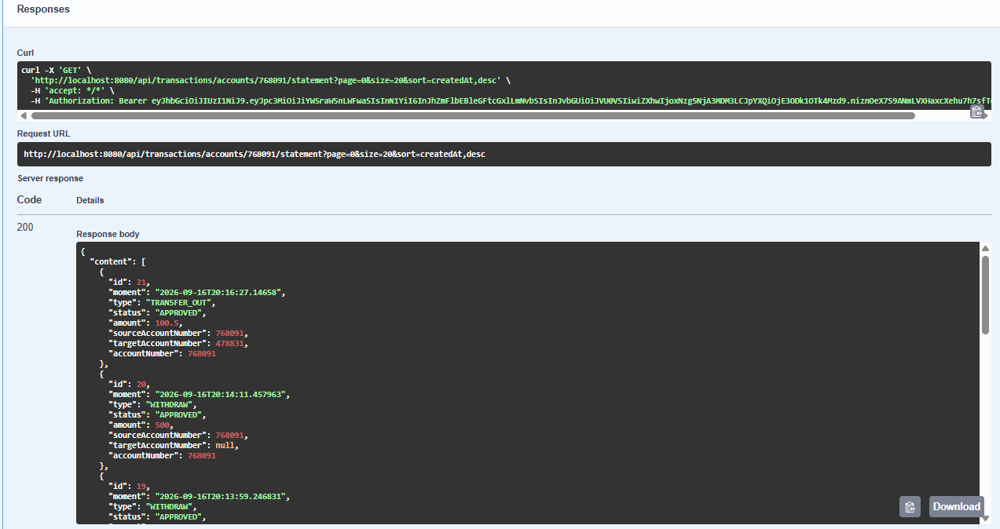

# Banking API

[](https://www.oracle.com/java/)
[](https://spring.io/projects/spring-boot)
[](https://maven.apache.org/)
[](https://www.mysql.com/)
[](LICENSE)

API REST para gerenciamento de operações bancárias, desenvolvida com Java 21 e Spring Boot.

O projeto possui autenticação JWT, refresh token, controle de acesso por usuário, gerenciamento de clientes e contas, depósitos, saques, transferências, extrato, rate limiting, logs estruturados, cache opcional com Redis e documentação OpenAPI.

## Funcionalidades

- Registro e autenticação de usuários.
- Access token JWT e refresh token persistido e revogável.
- Roles `USER` e `ADMIN`.
- Controle de ownership entre usuário, cliente e conta.
- Cadastro e atualização de clientes.
- Criação, bloqueio, ativação e encerramento lógico de contas.
- Contas `CHECKING` e `SAVINGS`.
- Depósitos, saques e transferências.
- Extrato paginado e filtrável.
- Validação de requests com Bean Validation.
- Tratamento global de exceções.
- Rate limiting para login e transações.
- CORS configurável.
- Logs em formato JSON.
- Cache de clientes com Redis opcional.
- Migrations com Flyway.
- Documentação interativa com Swagger UI.

## Tecnologias

| Tecnologia | Versão | Uso |
|---|---:|---|
| Java | 21 | Linguagem principal |
| Spring Boot | 3.2.5 | Framework da aplicação |
| Spring Security | 6.x | Autenticação e autorização |
| Nimbus JOSE+JWT | 9.37.3 | JWT |
| Spring Data JPA | 3.x | Persistência |
| MySQL | 8.x | Banco de dados |
| Redis | 7.x | Cache opcional |
| Flyway | 10.x | Migrations |
| H2 | 2.x | Testes de integração |
| Springdoc OpenAPI | 2.3.0 | Swagger UI |
| Maven | 3.9+ | Build |
| Docker Compose | 3.8 | Infraestrutura local |

## Demonstração

### Arquitetura do sistema


### Modelo de domínio


### Swagger UI

As capturas abaixo mostram a documentação interativa da API organizada nos grupos `Accounts`, `Clients`, `Transactions`, `Users` e `Authentication`. Os cadeados indicam as rotas protegidas por JWT.


### Autorização com JWT

O botão **Authorize** permite informar o access token no esquema `bearerAuth`. Depois da autorização, o Swagger envia automaticamente o header `Authorization: Bearer <accessToken>` nas requisições protegidas.


Para executar uma chamada, abra o endpoint, selecione **Try it out**, preencha os parâmetros ou o JSON e clique em **Execute**. O Swagger exibe a URL, o comando `curl`, o status HTTP e o corpo da resposta.

### Login

O endpoint `POST /api/auth/login` valida as credenciais do usuário e retorna um access token JWT, utilizado para autenticar as chamadas protegidas, além de um refresh token para renovação da sessão. A resposta também informa o tempo de expiração do access token.



### Criação de conta corrente

O endpoint `POST /api/accounts` cria uma conta do tipo `CHECKING` associada ao cliente autenticado. A resposta `201 Created` apresenta o número da conta, o cliente relacionado, o status inicial `ACTIVE`, o saldo inicial e as configurações de tarifa e juros.



### Extrato

O endpoint `GET /api/transactions/accounts/{accountNumber}/statement` retorna as movimentações da conta em formato paginado. Cada registro informa o tipo da transação, o status, o valor, as contas de origem e destino e o momento da operação. O extrato também permite filtros por tipo e período.



### Controle de acesso

O controle de acesso combina autenticação JWT, roles e ownership. Usuários autenticados só podem operar clientes e contas associados ao próprio usuário, enquanto administradores possuem permissões adicionais. A imagem abaixo mostra uma tentativa de acesso negada, com resposta `403 Forbidden`, e a segunda captura mostra o tratamento padronizado de uma conta inexistente, com resposta `404 Not Found`.


## Organização do código

```text
src/main/java/com/ricardosenna/bankingapi
├── config        Configurações de segurança, CORS e OpenAPI
├── controller    Endpoints REST
├── dto           Requests e responses
├── entity        Entidades JPA
├── enums         Enumerações de domínio
├── exception     Exceções e tratamento global
├── repository    Interfaces Spring Data JPA
├── security      JWT e rate limiting
└── service       Regras de negócio
```

## Como executar

### Pré-requisitos

- Java 21 ou superior.
- Maven 3.9 ou superior.
- Docker e Docker Compose.

### 1. Clonar o projeto

```bash
git clone https://github.com/RicardoSenna4/banking-api.git
cd banking-api
```

### 2. Iniciar MySQL e Redis

```bash
docker compose up -d
```

Serviços iniciados:

- MySQL em `localhost:3306`;
- Redis em `localhost:6379`.

### 3. Configurar variáveis de ambiente

```bash
export DB_USERNAME="root"
export DB_PASSWORD="secret"
export JWT_SECRET="$(openssl rand -base64 32)"
export CORS_ALLOWED_ORIGINS="http://localhost:5173"
```

### 4. Executar a aplicação

```bash
mvn spring-boot:run
```

A API ficará disponível em:

```text
http://localhost:8080
```

As migrations do Flyway são executadas automaticamente na inicialização.

## Configuração

| Variável | Padrão | Descrição |
|---|---|---|
| `DB_USERNAME` | `root` | Usuário do MySQL |
| `DB_PASSWORD` | `secret` | Senha do MySQL |
| `JWT_SECRET` | Valor de desenvolvimento | Chave para assinatura dos JWTs |
| `JWT_REFRESH_EXPIRATION_SECONDS` | `604800` | Validade do refresh token |
| `CACHE_TYPE` | `simple` | Use `redis` para cache distribuído |
| `REDIS_HOST` | `localhost` | Host do Redis |
| `REDIS_PORT` | `6379` | Porta do Redis |
| `CORS_ALLOWED_ORIGINS` | `http://localhost:5173` | Origens permitidas |

## Swagger/OpenAPI

Com a aplicação em execução:

- [Swagger UI](http://localhost:8080/swagger-ui.html)
- [OpenAPI JSON](http://localhost:8080/v3/api-docs)

Para testar rotas protegidas no Swagger:

1. Execute o login.
2. Copie o `accessToken`.
3. Clique em **Authorize**.
4. Informe `Bearer <accessToken>`.
5. Execute a operação desejada.

## Endpoints

### Autenticação

| Método | Endpoint | Permissão | Descrição |
|---|---|---|---|
| `POST` | `/api/auth/register` | Pública | Registra usuário |
| `POST` | `/api/auth/login` | Pública | Gera access e refresh tokens |
| `POST` | `/api/auth/refresh` | Pública | Renova access token |
| `POST` | `/api/auth/logout` | Pública | Revoga refresh token |

### Clientes

| Método | Endpoint | Permissão | Descrição |
|---|---|---|---|
| `POST` | `/api/clients` | Usuário autenticado | Cria perfil do cliente |
| `GET` | `/api/clients/{cpf}` | Ownership ou `ADMIN` | Consulta cliente |
| `GET` | `/api/clients` | `ADMIN` | Lista clientes |
| `PUT` | `/api/clients/{cpf}` | Ownership | Atualiza cliente |
| `PATCH` | `/api/clients/{cpf}/status` | `ADMIN` | Altera status |

### Contas

| Método | Endpoint | Permissão | Descrição |
|---|---|---|---|
| `POST` | `/api/accounts` | Ownership | Cria conta |
| `GET` | `/api/accounts/{number}` | Ownership ou `ADMIN` | Consulta conta |
| `GET` | `/api/accounts?clientId={id}` | Ownership ou `ADMIN` | Lista contas |
| `PATCH` | `/api/accounts/{number}/status` | Ownership ou `ADMIN` | Altera status |
| `DELETE` | `/api/accounts/{number}` | Ownership ou `ADMIN` | Encerra conta |

### Transações

| Método | Endpoint | Permissão | Descrição |
|---|---|---|---|
| `POST` | `/api/transactions/deposit` | Ownership | Realiza depósito |
| `POST` | `/api/transactions/withdraw` | Ownership | Realiza saque |
| `POST` | `/api/transactions/transfer` | Ownership da origem | Realiza transferência |
| `GET` | `/api/transactions/accounts/{number}/statement` | Ownership ou `ADMIN` | Consulta extrato |

Filtros disponíveis no extrato:

```text
?type=DEPOSIT&startDate=2026-01-01&endDate=2026-12-31&page=0&size=10
```

### Usuário autenticado

| Método | Endpoint | Descrição |
|---|---|---|
| `PUT` | `/api/users/me` | Atualiza nome e email |
| `PATCH` | `/api/users/me/password` | Altera senha |

## Exemplos de uso

### Registrar usuário

```bash
curl -X POST http://localhost:8080/api/auth/register \
  -H "Content-Type: application/json" \
  -d '{
    "name": "Ricardo Senna",
    "email": "ricardo@example.com",
    "password": "SenhaSegura123"
  }'
```

### Fazer login

```bash
curl -X POST http://localhost:8080/api/auth/login \
  -H "Content-Type: application/json" \
  -d '{
    "email": "ricardo@example.com",
    "password": "SenhaSegura123"
  }'
```

Resposta:

```json
{
  "accessToken": "eyJ...",
  "refreshToken": "random-value...",
  "expiresIn": 7200
}
```

### Criar cliente

```bash
curl -X POST http://localhost:8080/api/clients \
  -H "Authorization: Bearer <ACCESS_TOKEN>" \
  -H "Content-Type: application/json" \
  -d '{
    "cpf": "12345678901",
    "name": "João Silva",
    "email": "joao@example.com"
  }'
```

### Criar conta

```bash
curl -X POST http://localhost:8080/api/accounts \
  -H "Authorization: Bearer <ACCESS_TOKEN>" \
  -H "Content-Type: application/json" \
  -d '{
    "cpf": "12345678901",
    "type": "CHECKING",
    "withdrawFee": "2.00",
    "interestRate": null
  }'
```

### Depositar

```bash
curl -X POST http://localhost:8080/api/transactions/deposit \
  -H "Authorization: Bearer <ACCESS_TOKEN>" \
  -H "Content-Type: application/json" \
  -d '{
    "accountNumber": 100001,
    "amount": "500.00"
  }'
```

## Segurança

- Autenticação stateless com JWT.
- Autorização por roles `USER` e `ADMIN`.
- Controle de acesso por ownership.
- Senhas armazenadas com BCrypt.
- Refresh tokens armazenados somente como hash SHA-256.
- Expiração e revogação de refresh tokens.
- Rate limiting para login e transações.
- CORS configurável por ambiente.
- Endpoints protegidos por padrão.
- Logs sem senhas ou JWTs completos.

## Tratamento de erros

A API possui um `GlobalExceptionHandler` para retornar respostas padronizadas:

```json
{
  "timestamp": "2026-09-16T15:00:00Z",
  "status": 400,
  "error": "Bad Request",
  "message": "There are invalid fields in the request",
  "path": "/api/clients",
  "fieldErrors": {
    "cpf": "CPF must contain exactly 11 digits"
  }
}
```

| Status | Significado |
|---:|---|
| `201` | Recurso criado |
| `204` | Operação concluída sem conteúdo |
| `400` | Validação ou regra de negócio inválida |
| `401` | Token ausente, inválido ou expirado |
| `403` | Acesso negado |
| `404` | Recurso não encontrado |
| `409` | Conflito |
| `429` | Rate limit excedido |
| `500` | Erro interno |

## Testes

```bash
mvn test
```

Os testes cobrem autenticação JWT, endpoints REST, regras de negócio, ownership, refresh token, operações financeiras, validações e cenários de erro.

## Migrations

| Versão | Descrição |
|---|---|
| `V1` | Cria tabela de usuários |
| `V2` | Cria tabela de clientes |
| `V3` | Cria tabela de contas |
| `V4` | Cria tabela de transações |
| `V5` | Adiciona status às contas |
| `V6` | Relaciona clientes aos usuários |
| `V7` | Cria refresh tokens |

## Licença

Este projeto está licenciado sob a [MIT License](LICENSE).

## Autor

**Ricardo Senna**

[GitHub](https://github.com/RicardoSenna4) · [Repositório](https://github.com/RicardoSenna4/banking-api)
