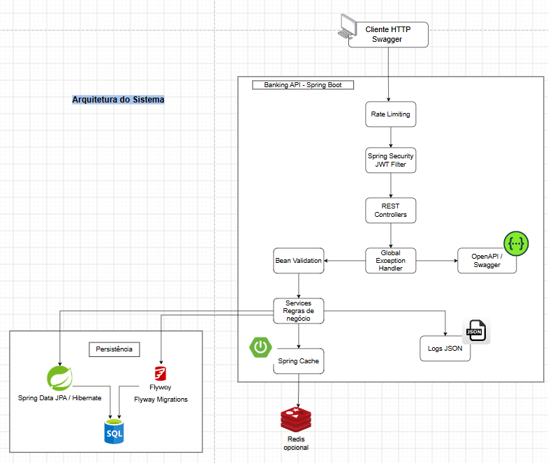
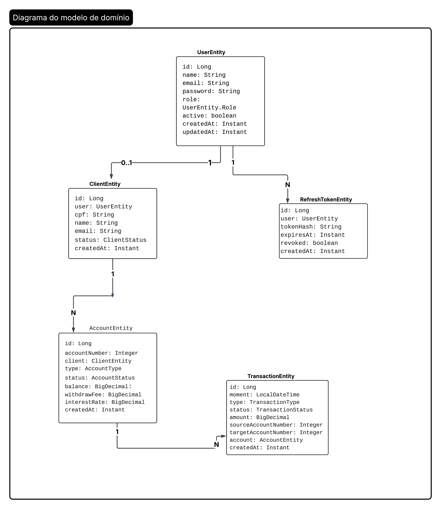
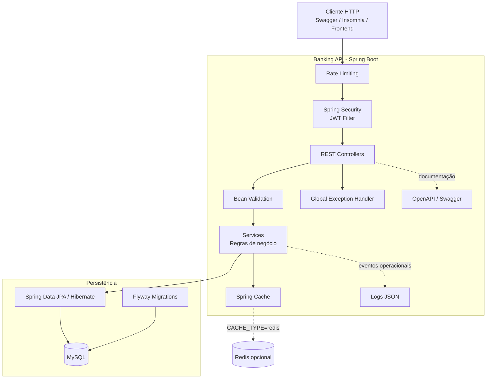
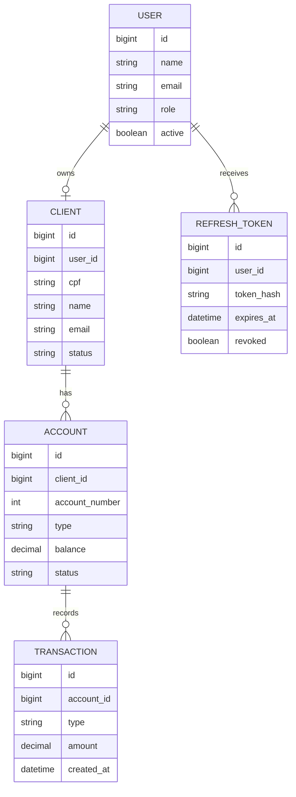
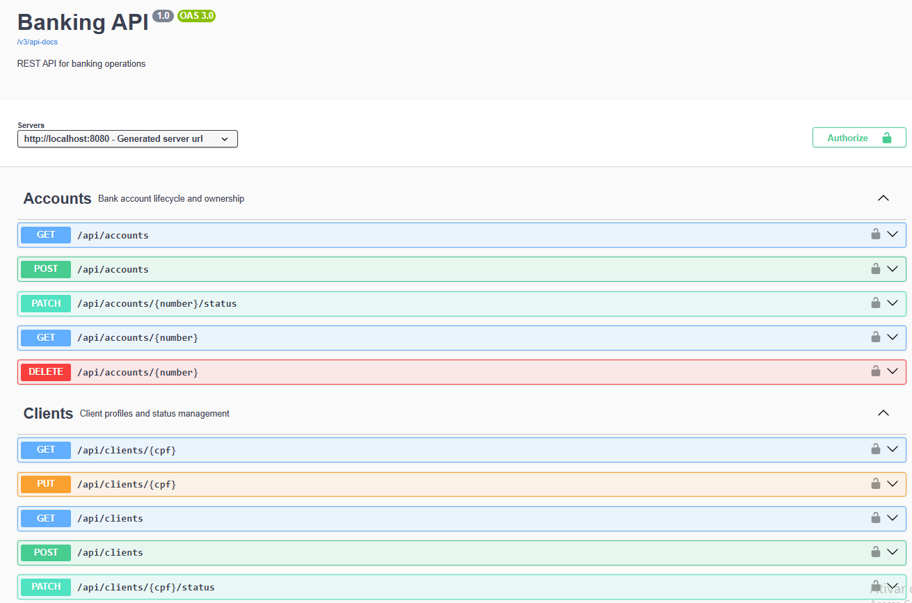
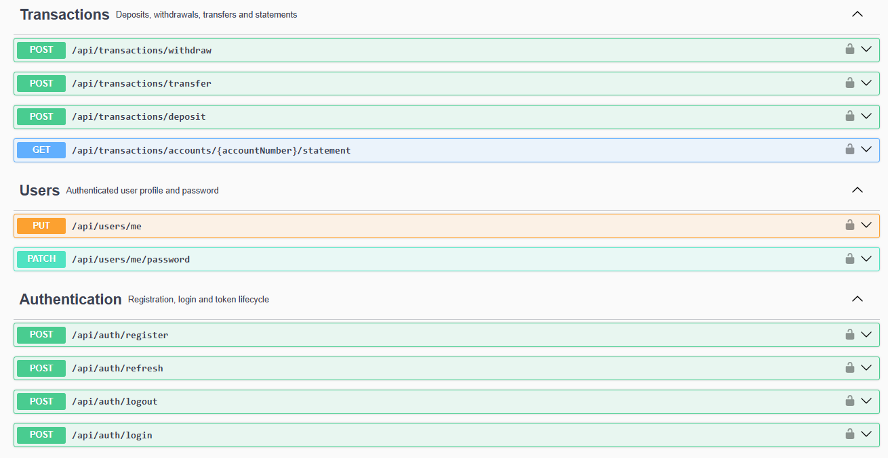
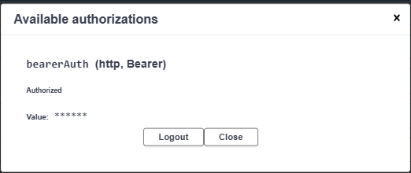
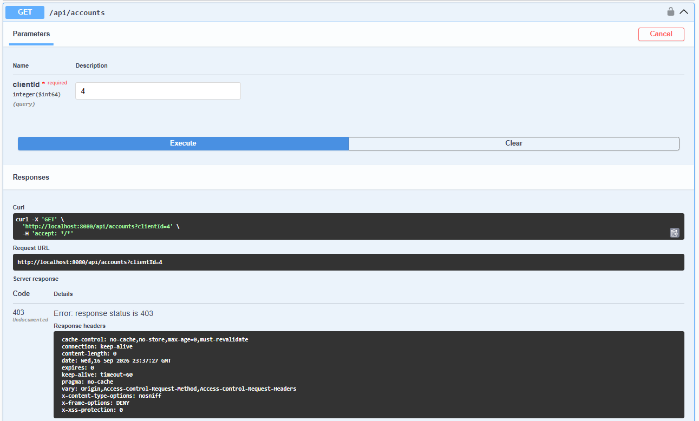
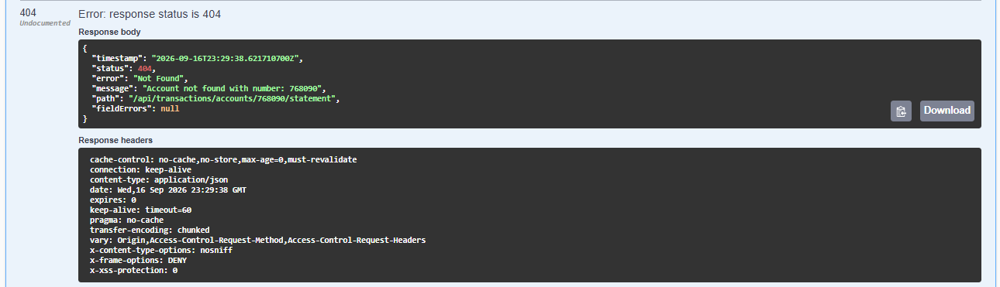

# Banking API

[](https://www.oracle.com/java/)
[](https://spring.io/projects/spring-boot)
[](https://maven.apache.org/)
[](https://www.mysql.com/)
[](LICENSE)

API REST para simulação de operações bancárias, desenvolvida com Java 21 e Spring Boot. O projeto demonstra a construção de um backend organizado, seguro e preparado para evolução, com autenticação JWT, controle de ownership, operações financeiras, migrations versionadas, documentação OpenAPI, rate limiting, logs estruturados e cache opcional com Redis.

> **Finalidade educacional:** este projeto é uma simulação para estudo e portfólio. Não deve ser utilizado para processar dinheiro real sem auditoria de segurança, controles antifraude, observabilidade, alta disponibilidade e conformidade regulatória.

## Sumário

- [Funcionalidades](#funcionalidades)
- [Destaques técnicos](#destaques-técnicos)
- [Demonstração visual](#demonstração-visual)
- [Arquitetura](#arquitetura)
- [Modelo de domínio](#modelo-de-domínio)
- [Fluxo de autenticação](#fluxo-de-autenticação)
- [Tecnologias](#tecnologias)
- [Como executar](#como-executar)
- [Variáveis de ambiente](#variáveis-de-ambiente)
- [Swagger/OpenAPI](#swaggeropenapi)
- [Endpoints](#endpoints)
- [Exemplos de uso](#exemplos-de-uso)
- [Segurança](#segurança)
- [Tratamento de erros](#tratamento-de-erros)
- [Testes](#testes)
- [Migrations](#migrations)
- [Próximas evoluções](#próximas-evoluções)
- [Licença](#licença)

## Funcionalidades

- Registro e autenticação de usuários.
- Access token JWT e refresh token persistido, com hash, expiração e revogação.
- Logout e revogação de refresh token.
- Roles `USER` e `ADMIN`.
- Relacionamento de ownership `User → Client → Account`.
- Cadastro e atualização de clientes.
- Criação, bloqueio, ativação e encerramento lógico de contas.
- Contas dos tipos `CHECKING` e `SAVINGS`.
- Depósitos, saques e transferências entre contas.
- Extrato paginado e filtrável por tipo e período.
- Validação de requests com Bean Validation.
- Tratamento global e padronizado de exceções.
- Rate limiting para autenticação e operações financeiras.
- CORS configurável para integração com frontend.
- Logs estruturados em JSON.
- Cache de clientes com suporte a Redis opcional.
- Documentação interativa com Swagger UI e OpenAPI.
- Migrations de banco de dados com Flyway.

## Destaques técnicos

Este projeto demonstra conhecimentos em:

- Desenvolvimento de APIs REST com Spring Boot.
- Arquitetura em camadas (`Controller → Service → Repository`).
- Autenticação e autorização com Spring Security.
- Geração e validação de JWT usando Nimbus JOSE+JWT.
- Refresh token seguro e revogável.
- Controle de acesso baseado em ownership e roles.
- Modelagem relacional com JPA/Hibernate.
- Versionamento de schema com Flyway.
- Operações monetárias com `BigDecimal`.
- Testes unitários, de integração e de endpoints.
- Documentação de API com OpenAPI.
- Cache local e cache distribuído com Redis.
- Configuração por variáveis de ambiente.
- Execução das dependências com Docker Compose.

## Demonstração visual

As imagens abaixo mostram a API em execução, sua arquitetura, o modelo de domínio, a documentação interativa e alguns cenários de autorização e tratamento de erros.

### Arquitetura do sistema



### Modelo de domínio



## Arquitetura

A aplicação utiliza uma arquitetura em camadas. Os controllers recebem as requisições HTTP, os services concentram as regras de negócio e os repositories realizam o acesso aos dados por meio do Spring Data JPA.



Uma versão visual do fluxo acima também está disponível em [`docs/images/architecture.png`](docs/images/architecture.png).

### Organização do código

```text
src/main/java/com/ricardosenna/bankingapi
├── config        Configurações de segurança, CORS e OpenAPI
├── controller    Endpoints REST
├── dto           Requests e responses da API
├── entity        Entidades JPA
├── enums         Enumerações de domínio
├── exception     Exceções e tratamento global
├── repository    Interfaces Spring Data JPA
├── security      JWT e rate limiting
└── service       Regras de negócio
```

## Modelo de domínio

O relacionamento principal garante que cada usuário comum opere somente os recursos que lhe pertencem. Usuários `ADMIN` possuem acesso administrativo conforme as regras de autorização.



## Fluxo de autenticação

A API utiliza um access token JWT para autenticar as requisições e um refresh token persistido para renovar a sessão sem exigir novo login.

```text
POST /api/auth/login
        │
        ▼
Access Token JWT + Refresh Token
        │
        ▼
Requisições com Authorization: Bearer <access-token>
        │
        ▼
Access token expira
        │
        ▼
POST /api/auth/refresh
        │
        ▼
Novo access token
        │
        ▼
POST /api/auth/logout
        │
        ▼
Refresh token revogado
```

O refresh token é gerado com valor aleatório seguro e armazenado no banco somente como hash SHA-256. Ele também é invalidado quando o usuário altera a senha.

## Tecnologias

| Tecnologia | Versão | Utilização |
|---|---:|---|
| Java | 21 | Linguagem principal |
| Spring Boot | 3.2.5 | Framework da aplicação |
| Spring Web | 6.x | API REST |
| Spring Security | 6.x | Autenticação e autorização |
| Nimbus JOSE+JWT | 9.37.3 | JWT |
| Spring Data JPA | 3.x | Persistência e Hibernate |
| Flyway | 10.x | Migrations |
| MySQL | 8.x | Banco principal |
| Redis | 7.x | Cache opcional |
| H2 | 2.x | Banco em memória para testes |
| Springdoc OpenAPI | 2.3.0 | Swagger UI e documentação |
| Maven | 3.9+ | Build e gerenciamento de dependências |
| Docker Compose | 3.8 | Infraestrutura local |

## Como executar

### Pré-requisitos

- Java 21 ou superior.
- Maven 3.9 ou superior.
- Docker e Docker Compose — recomendado para MySQL e Redis.

### 1. Clonar o projeto

```bash
git clone https://github.com/RicardoSenna4/banking-api.git
cd banking-api
```

### 2. Iniciar a infraestrutura

```bash
docker compose up -d
```

Esse comando inicia:

- MySQL em `localhost:3306`;
- Redis em `localhost:6379`.

### 3. Configurar as variáveis de ambiente

```bash
export DB_USERNAME="root"
export DB_PASSWORD="secret"
export JWT_SECRET="$(openssl rand -base64 32)"
export CORS_ALLOWED_ORIGINS="http://localhost:5173"
```

### 4. Executar a aplicação

```bash
mvn spring-boot:run
```

A API ficará disponível em:

```text
http://localhost:8080
```

As migrations do Flyway são executadas automaticamente na inicialização.

## Variáveis de ambiente

| Variável | Padrão | Descrição |
|---|---|---|
| `DB_USERNAME` | `root` | Usuário do banco |
| `DB_PASSWORD` | `secret` | Senha do banco |
| `JWT_SECRET` | Valor de desenvolvimento | Chave usada para assinar JWT; altere em ambientes reais |
| `JWT_REFRESH_EXPIRATION_SECONDS` | `604800` | Validade do refresh token, em segundos |
| `CACHE_TYPE` | `simple` | Use `redis` para cache distribuído |
| `REDIS_HOST` | `localhost` | Host do Redis |
| `REDIS_PORT` | `6379` | Porta do Redis |
| `CORS_ALLOWED_ORIGINS` | `http://localhost:5173` | Origens permitidas pelo CORS |

> Em produção, nunca utilize credenciais, chaves JWT ou senhas padrão. Prefira secrets managers e variáveis protegidas do ambiente de execução.

## Swagger/OpenAPI

Com a aplicação em execução, acesse:

- [Swagger UI](http://localhost:8080/swagger-ui.html)
- [OpenAPI JSON](http://localhost:8080/v3/api-docs)

Para testar endpoints protegidos:

1. Execute o login.
2. Copie o `accessToken` retornado.
3. Clique em **Authorize** no Swagger UI.
4. Informe `Bearer <accessToken>`.
5. Execute as operações autenticadas.

### Swagger UI em execução





### Autorização com JWT

O Swagger utiliza o esquema `bearerAuth` para enviar o access token nas requisições protegidas.



## Endpoints

### Autenticação

| Método | Endpoint | Autenticação | Permissão | Descrição |
|---|---|---|---|---|
| `POST` | `/api/auth/register` | Não | Pública | Registra um usuário |
| `POST` | `/api/auth/login` | Não | Pública | Gera access e refresh tokens |
| `POST` | `/api/auth/refresh` | Não | Pública | Renova o access token |
| `POST` | `/api/auth/logout` | Não | Pública | Revoga o refresh token |

### Clientes

| Método | Endpoint | Autenticação | Permissão | Descrição |
|---|---|---|---|---|
| `POST` | `/api/clients` | JWT | Usuário autenticado | Cria o perfil do cliente |
| `GET` | `/api/clients/{cpf}` | JWT | Ownership ou `ADMIN` | Busca cliente por CPF |
| `GET` | `/api/clients` | JWT | `ADMIN` | Lista clientes com paginação |
| `PUT` | `/api/clients/{cpf}` | JWT | Ownership | Atualiza nome e email |
| `PATCH` | `/api/clients/{cpf}/status` | JWT | `ADMIN` | Altera status do cliente |

### Contas

| Método | Endpoint | Autenticação | Permissão | Descrição |
|---|---|---|---|---|
| `POST` | `/api/accounts` | JWT | Ownership | Cria uma conta |
| `GET` | `/api/accounts/{number}` | JWT | Ownership ou `ADMIN` | Consulta conta por número |
| `GET` | `/api/accounts?clientId={id}` | JWT | Ownership ou `ADMIN` | Lista contas do cliente |
| `PATCH` | `/api/accounts/{number}/status` | JWT | Ownership ou `ADMIN` | Bloqueia ou ativa conta |
| `DELETE` | `/api/accounts/{number}` | JWT | Ownership ou `ADMIN` | Encerra conta com saldo zero |

### Transações

| Método | Endpoint | Autenticação | Permissão | Descrição |
|---|---|---|---|---|
| `POST` | `/api/transactions/deposit` | JWT | Ownership | Realiza depósito |
| `POST` | `/api/transactions/withdraw` | JWT | Ownership | Realiza saque |
| `POST` | `/api/transactions/transfer` | JWT | Ownership da origem | Transfere entre contas |
| `GET` | `/api/transactions/accounts/{number}/statement` | JWT | Ownership ou `ADMIN` | Consulta extrato paginado e filtrável |

Filtros disponíveis no extrato:

```text
?type=DEPOSIT&startDate=2026-01-01&endDate=2026-12-31&page=0&size=10
```

### Usuário autenticado

| Método | Endpoint | Autenticação | Descrição |
|---|---|---|---|
| `PUT` | `/api/users/me` | JWT | Atualiza nome e email |
| `PATCH` | `/api/users/me/password` | JWT | Altera senha informando a senha atual |

## Exemplos de uso

### Registrar usuário

```bash
curl -X POST http://localhost:8080/api/auth/register \
  -H "Content-Type: application/json" \
  -d '{
    "name": "Ricardo Senna",
    "email": "ricardo@example.com",
    "password": "SenhaSegura123"
  }'
```

### Fazer login

```bash
curl -X POST http://localhost:8080/api/auth/login \
  -H "Content-Type: application/json" \
  -d '{
    "email": "ricardo@example.com",
    "password": "SenhaSegura123"
  }'
```

Resposta simplificada:

```json
{
  "accessToken": "eyJ...",
  "refreshToken": "random-value...",
  "expiresIn": 7200
}
```

### Criar cliente

```bash
curl -X POST http://localhost:8080/api/clients \
  -H "Authorization: Bearer <ACCESS_TOKEN>" \
  -H "Content-Type: application/json" \
  -d '{
    "cpf": "12345678901",
    "name": "João Silva",
    "email": "joao@example.com"
  }'
```

### Criar conta

```bash
curl -X POST http://localhost:8080/api/accounts \
  -H "Authorization: Bearer <ACCESS_TOKEN>" \
  -H "Content-Type: application/json" \
  -d '{
    "cpf": "12345678901",
    "type": "CHECKING",
    "withdrawFee": "2.00",
    "interestRate": null
  }'
```

### Realizar depósito

```bash
curl -X POST http://localhost:8080/api/transactions/deposit \
  -H "Authorization: Bearer <ACCESS_TOKEN>" \
  -H "Content-Type: application/json" \
  -d '{
    "accountNumber": 1001,
    "amount": "500.00"
  }'
```

### Renovar access token

```bash
curl -X POST http://localhost:8080/api/auth/refresh \
  -H "Content-Type: application/json" \
  -d '{
    "refreshToken": "<REFRESH_TOKEN>"
  }'
```

## Segurança

A API aplica as seguintes medidas:

- autenticação stateless com JWT;
- autorização baseada nas roles `USER` e `ADMIN`;
- controle de acesso por ownership;
- senhas armazenadas com BCrypt;
- refresh token persistido somente como hash SHA-256;
- expiração e revogação de refresh tokens;
- revogação dos tokens após alteração de senha;
- rate limiting para login e operações em `/api/transactions/**`;
- resposta `429 Too Many Requests` com header `Retry-After`;
- CORS configurável por ambiente;
- endpoints protegidos por padrão;
- logs sem senhas ou JWTs completos.

## Recursos operacionais

- **Rate limiting:** login limitado a 5 requisições por minuto por IP; transações limitadas a 30 requisições por minuto por IP.
- **CORS:** origem padrão `http://localhost:5173`, configurável com `CORS_ALLOWED_ORIGINS`.
- **Logs:** Logback configurado para emitir eventos em JSON.
- **Cache:** clientes podem ser cacheados; saldos e extratos não são cacheados para evitar dados financeiros obsoletos.
- **Redis:** disponível no Docker Compose e ativado com `CACHE_TYPE=redis`.

## Tratamento de erros

As exceções são convertidas pelo `GlobalExceptionHandler` para um formato consistente:

```json
{
  "timestamp": "2026-09-16T15:00:00Z",
  "status": 400,
  "error": "Bad Request",
  "message": "There are invalid fields in the request",
  "path": "/api/clients",
  "fieldErrors": {
    "cpf": "CPF must contain exactly 11 digits"
  }
}
```

| Status | Significado |
|---:|---|
| `201` | Recurso criado com sucesso |
| `204` | Operação concluída sem conteúdo |
| `400` | Validação ou regra de negócio inválida |
| `401` | Token ausente, inválido ou expirado |
| `403` | Usuário sem permissão ou sem ownership |
| `404` | Recurso não encontrado |
| `409` | Conflito, como CPF ou email duplicado |
| `429` | Rate limit excedido |
| `500` | Erro interno inesperado |

### Exemplo de acesso negado

Quando um usuário autenticado tenta acessar um recurso pertencente a outro usuário, a API responde com `403 Forbidden`.



### Exemplo de recurso não encontrado

Quando a conta solicitada não existe, a API responde com `404 Not Found` e uma mensagem padronizada.



## Testes

Execute a suíte com:

```bash
mvn test
```

Os testes utilizam H2 em memória e cobrem:

- integração da camada de serviços;
- geração, validação e rejeição de JWT;
- endpoints REST com MockMvc;
- validações e regras de negócio;
- saldo insuficiente e cliente bloqueado;
- refresh token e revogação;
- isolamento de contas entre usuários;
- cenários negativos.

## Migrations

| Versão | Descrição |
|---|---|
| `V1` | Cria a tabela `users` |
| `V2` | Cria a tabela `clients` |
| `V3` | Cria a tabela `accounts` |
| `V4` | Cria a tabela `transactions` |
| `V5` | Adiciona status ao ciclo de vida das contas |
| `V6` | Relaciona clientes aos usuários |
| `V7` | Cria refresh tokens persistidos e revogáveis |

## Próximas evoluções

- [ ] Adicionar pipeline de CI/CD com GitHub Actions.
- [ ] Criar testes de contrato da API.
- [ ] Adicionar métricas com Spring Actuator e Prometheus.
- [ ] Implementar tracing distribuído.
- [ ] Criar um frontend demonstrativo.
- [ ] Publicar a aplicação em um ambiente cloud.
- [ ] Adicionar testes de carga para operações financeiras.
- [ ] Evoluir o rate limiting para armazenamento distribuído em Redis.

## Licença

Este projeto está licenciado sob a [MIT License](LICENSE).

## Autor

**Ricardo Senna**

- GitHub: [RicardoSenna4](https://github.com/RicardoSenna4)
- Repositório: [banking-api](https://github.com/RicardoSenna4/banking-api)
